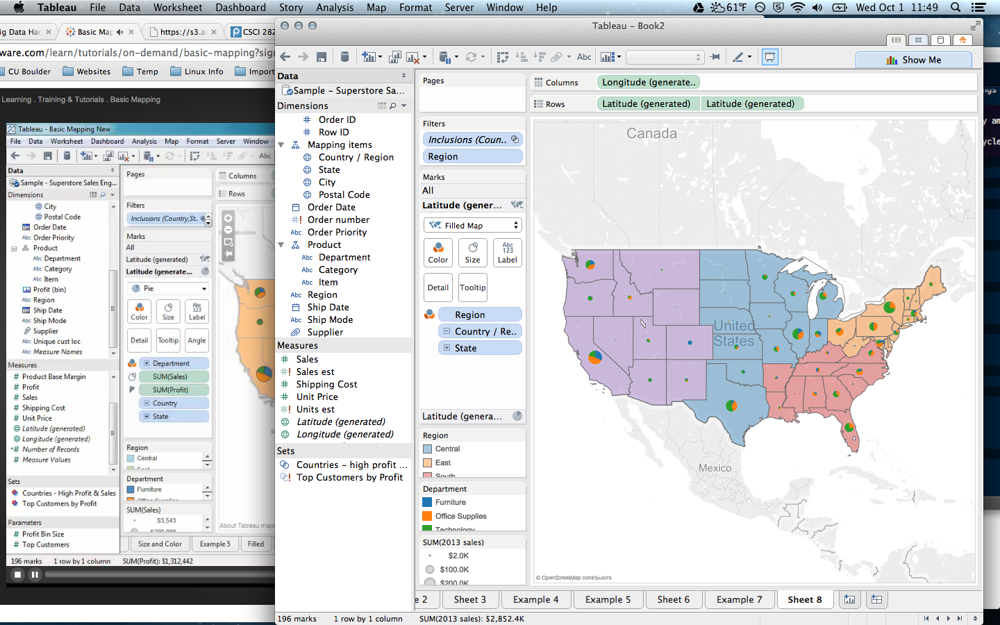
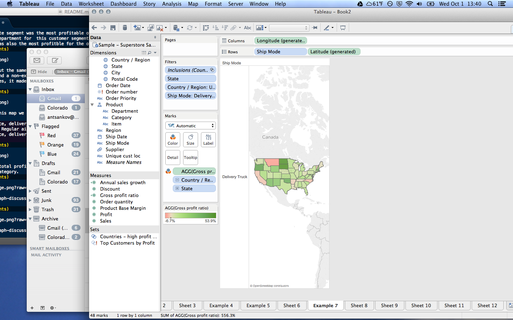

# Name

Alexander Tsankov

# How many points have you earned?

0/100

(Make your own calculation and replace the number 0 with the points you think you've earned.)

# How many hours have you spent on this?

fill-in-your-answer

# What is the most difficult part about this week's challenge?

fill-in-your-answer

# Show and tell (9 points)

## Link (2 points)

[NoSQL explained](http://www.mongodb.com/nosql-explained)

## What are the limitations of SQL? How are NoSQL solutions trying to address them (name three)? (7 points)

Some of the solutions that NoSQL offer to meet the shortcomings of SQL are:

- Allow on the fly changes to the DB schema. 
- Autosharding which allows data to be split more effectively amongst multiple devices. 
- Generally open source, so cheaper and faster development cycles. 

# Tableau (II) (3 points x 4 + 5 points x 7 = 47 points)

## Checkpoints

### 1 (3 points)

### 2 (3 points)

### 3 (3 points)

### 4 (3 points)

## Challenges

### 1 (5 points)

Miami, in Florida, and Detroirt in Michigan both had relatively large sales figures as evidenced by the above-average size of their sales area, but neither of them made a large profit. We can compare this to the deeper green of large areas, especially New York and Washington DC 
### 2 (5 points)

The corportate segment was the most profitable of the customer segments. The most profitable department for  this customer segment was technology. The technology department was also the most profitble for the other customer segments as well. 
### 3 (5 points)

Iraq had about the same sales as Egypt, however it had issues in it's furniture department and a non-existent technology department. Instead of making up a third of total sales, it made up around a 1/8 of total profits for the country. 

### 4 (5 points)

Looking at this map we can see the following routes that lose money: 

1. Home office, delivery truck, Durango Colorado. 
2. Consumer, Regular air, Boise Idaho.
3. Home office, delivery truck, Gailsburg Illinois.

### 5 (5 points)

In terms of total profits, Texas significantly outperformed California in the "consumer" category. 
### 6 (5 points)

We can see in this chart that delivery truck shipments to the following states lose money: 

- Montana
- California
- North Carolina 
- Vermont

### 7 (5 points)

1. Total sales in Colorado: $132.2K.

2. States with similar sales: Alabama, $126.7K; Maryland, $124.9K; New Jersey, $143.4K; Wisconsin, $148.7K

3. These states differ in that they are each from different parts of the country. We can get a good understanding of different regions by analyzing each of the different states. We can see that the eastern states are much more pofitable with delivery trucks delivering technolgy than the western states are. 

4. These states are each unique in the regular air sector. Some of them make a profit and some of them don't there doesn't seem to be any discernable pattern.

5. Colorado loses a lot of money from express air furniture deliveries. It is at -384% profibility. The next lowest is New Jersey at -151.8% profitibility for its express air furniture deliveries. 

# MongoDB 1

## Checkpoints (5 points x 4 + 6 points x 4 = 44  points)

### 1 (5 points)

### 2 (5 points)

### 3 (5 points)

### 4 (5 points)

## Challenges

### 1 (6 points)

[mongodb1.js](mongodb1.js)

### 2 (6 points)

[mongodb2.js](mongodb2.js)

### 3 (6 points)

[mongodb3.js](mongodb3.js)

### 4 (6 points)

[mongodb4.js](mongodb4.js)
