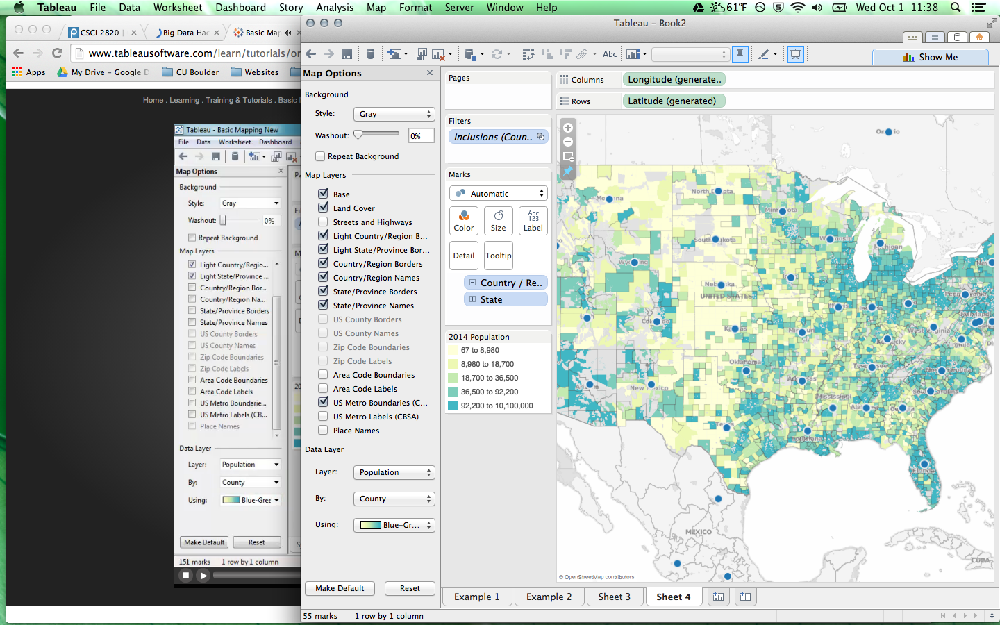
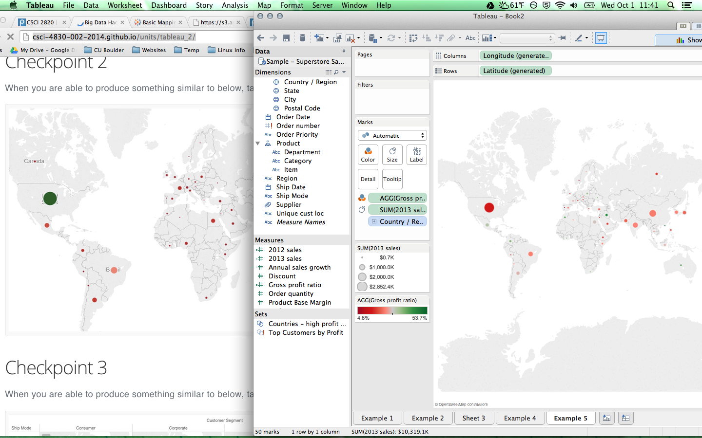

# Name

Alexander Tsankov

# How many points have you earned?

0/100

(Make your own calculation and replace the number 0 with the points you think you've earned.)

# How many hours have you spent on this?

fill-in-your-answer

# What is the most difficult part about this week's challenge?

fill-in-your-answer

# Show and tell (9 points)

## Link (2 points)

[NoSQL explained](http://www.mongodb.com/nosql-explained)

## What are the limitations of SQL? How are NoSQL solutions trying to address them (name three)? (7 points)

Some of the solutions that NoSQL offer to meet the shortcomings of SQL are:

- Allow on the fly changes to the DB schema. 
- Autosharding which allows data to be split more effectively amongst multiple devices. 
- Generally open source, so cheaper and faster development cycles. 

# Tableau (II) (3 points x 4 + 5 points x 7 = 47 points)

## Checkpoints

### 1 (3 points)

### 2 (3 points)

### 3 (3 points)

### 4 (3 points)

## Challenges

### 1 (5 points)

Miami, in Florida, and Detroirt in Michigan both had relatively large sales figures as evidenced by the above-average size of their sales area, but neither of them made a large profit. We can compare this to the deeper green of large areas, especially New York and Washington DC 
### 2 (5 points)

The corportate segment was the most profitable of the customer segments. The most profitable department for  this customer segment was technology. The technology department was also the most profitble for the other customer segments as well. 
### 3 (5 points)

{{one-paragraph-discussion-of-your-answer}}

### 4 (5 points)

{{one-paragraph-discussion-of-your-answer}}

### 5 (5 points)

{{one-paragraph-discussion-of-your-answer}}

### 6 (5 points)

{{one-paragraph-discussion-of-your-answer}}

### 7 (5 points)

{{one-paragraph-discussion-of-your-answer}}

# MongoDB 1

## Checkpoints (5 points x 4 + 6 points x 4 = 44  points)

### 1 (5 points)

### 2 (5 points)

### 3 (5 points)

### 4 (5 points)

## Challenges

### 1 (6 points)

[mongodb1.js](mongodb1.js)

### 2 (6 points)

[mongodb2.js](mongodb2.js)

### 3 (6 points)

[mongodb3.js](mongodb3.js)

### 4 (6 points)

[mongodb4.js](mongodb4.js)
